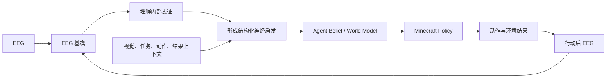

# 从脑电基模表征到具身 Agent：三层研究路线

## 1. 总体目标

本研究围绕三个递进层次展开：

1. **理解表征**：脑电基模内部形成了哪些表征，哪些是跨任务共享、任务特异或混杂表征，以及哪些表征真正参与了模型决策。
2. **形成启发**：将这些表征转化为上下文相关、带不确定性的 Agent 决策信号。
3. **嵌入场景**：在 Minecraft 闭环场景中检验这些神经启发能否改善错误归因、恢复决策和任务表现。

总体研究问题为：

> 脑电基模的上下文条件化表征，能否作为具身 Agent 的隐状态与因果反馈信号，帮助其判断发生了什么、为什么发生，以及下一步如何恢复？

三个层次分别对应三项科学主张：

| 层次 | 科学主张 |
|---|---|
| 理解表征 | 脑电基模内部存在稳定、可解释、可迁移且被模型实际使用的表征 |
| 形成启发 | 这些表征能够提供环境上下文之外的、经过校准的 Agent 决策信息 |
| 嵌入场景 | 神经启发能够在开放世界闭环中改善 Agent 的决策和恢复行为 |

---

## 2. 第一层：理解表征

### 2.1 目标

回答脑电基模究竟编码了什么，以及这些信息是否真的被下游任务使用。

这一层需要明确区分：

\[
\text{可解码}
\neq
\text{任务实际使用}
\neq
\text{跨场景稳定}
\]

### 2.2 阅读材料

#### EEG 基模

- [LaBraM: Large Brain Model for Learning Generic Representations with Tremendous EEG Data in BCI](https://mlanthology.org/iclr/2024/jiang2024iclr-large/)
  - 大规模 Transformer、神经 tokenizer、masked code prediction。
  - 适合研究大模型的逐层表征发展。

- [CBraMod: A Criss-Cross Brain Foundation Model for EEG Decoding](https://proceedings.iclr.cc/paper_files/paper/2025/hash/bbbd6d915cb90be21c1254a82d45cedd-Abstract-Conference.html)
  - 分离空间与时间注意力。
  - 适合分析空间、时间和频谱表征的分工。

- [EEGPT: Pretrained Transformer for Universal and Reliable Representation of EEG Signals](https://proceedings.neurips.cc/paper_files/paper/2024/file/4540d267eeec4e5dbd9dae9448f0b739-Paper-Conference.pdf)
  - 层级时空结构与自监督表征对齐。

- [REVE: A Foundation Model for EEG](https://proceedings.neurips.cc/paper_files/paper/2025/file/20a917f77773ac0fa8bea2bdd6606b66-Paper-Conference.pdf)
  - 强调跨数据集、电极布局和任务泛化。

#### 直接研究脑电基模表征的工作

- [What Do EEG Foundation Models Capture from Human Brain Signals?](https://arxiv.org/abs/2605.11410)
  - 逐层探针、概念子空间擦除和已知 EEG 特征解释率。
  - 2026 年预印本。

- [PRiSE-EEG: A Prior-Guided Foundation Model with Depth-Stratified Experts for Cross-Paradigm EEG Representation Learning](https://arxiv.org/abs/2605.18085)
  - 使用 CKA 比较跨范式表征共享性。
  - 2026 年预印本。

- [Explainable AI Insights Into EEG Classification and Its Alignment to Neural Correlates](https://pubmed.ncbi.nlm.nih.gov/42037083/)
  - 使用 Concept Relevance Propagation 分析不同任务中的神经概念。

#### 表征分析方法

- [Similarity of Neural Network Representations Revisited](https://proceedings.mlr.press/v97/kornblith19a.html)：CKA。
- [Designing and Interpreting Probes with Control Tasks](https://aclanthology.org/D19-1275/)：受控探针。
- [LEACE: Perfect Linear Concept Erasure in Closed Form](https://proceedings.neurips.cc/paper_files/paper/2023/hash/d066d21c619d0a78c5b557fa3291a8f4-Abstract-Conference.html)：概念子空间擦除。
- [Clarifying the Conceptual Dimensions of Representation in Neuroscience](https://www.nature.com/articles/s41583-026-01030-8.pdf)：sensitivity、specificity、invariance 与 functionality。

### 2.3 需要探索的问题

#### 表征内容

- 模型是否编码频带功率、ERP、连接性、复杂度、空间拓扑？
- 是否编码任务、被试、数据集、设备和导联布局？
- 是否存在人工 EEG 特征词典无法解释的剩余表征？

#### 表征层级

- 浅层是否主要表示局部波形和频谱？
- 中层是否整合时间与空间关系？
- 深层是否形成任务、认知状态和决策相关表征？
- 下游微调改变的是末端层，还是重塑整个 Encoder？

#### 共享性与混杂

- 哪些表征跨任务、跨被试、跨数据集共享？
- 所谓任务表征是否其实来自数据集、设备或被试差异？
- 被试身份与认知状态是否占用相同子空间？

#### 因果作用

- 擦除某个概念后，下游性能是否下降？
- 恢复某层激活后，错误预测能否恢复？
- 哪些信息虽然可以解码，但没有被模型实际使用？

### 2.4 建议实验

建立三类概念词典：

| 类型 | 变量示例 |
|---|---|
| 神经生理 | 频带、ERP、1/f、复杂度、连接性、空间拓扑 |
| 认知任务 | 注意、工作负荷、疲劳、错误、意外性、不确定性 |
| 混杂因素 | 被试、数据集、设备、导联、会话、预处理流程 |

实验顺序：

1. 逐层、逐时间探针；
2. CKA/RSA 比较不同模型、任务与微调阶段；
3. 方差分解区分生理、任务和混杂因素；
4. LEACE、消融和 activation patching 检验因果作用；
5. 对未解释残差使用稀疏自动编码器探索潜在特征。

### 2.5 评价指标

- 探针 AUROC、macro-F1、回归 \(R^2\)；
- 控制任务 selectivity；
- CKA/RSA 相似度；
- 各概念的独立与共享解释方差；
- 概念擦除后的性能变化；
- 跨被试、跨数据集和跨任务泛化；
- 与同维度随机子空间消融的差异。

### 2.6 阶段产出

- 一套 EEG 概念词典；
- 一张“层 × 时间 × 表征”的基模解剖图；
- 共享、任务特异和混杂子空间；
- 一组具有因果证据的候选表征。

### 2.7 进入下一层的判据

- 某些表征能够在留出被试或数据集上稳定解码；
- 结果可在至少两个结构不同的基模或多个任务上复现；
- 擦除目标子空间的影响大于同维度随机子空间；
- 结果无法被设备、数据集、运动或眼动伪迹充分解释。

---

## 3. 第二层：形成启发

### 3.1 目标

将“模型内部有什么”转化成“Agent 可以如何使用”。

传统 ErrP-RL 通常只形成二值反馈：

\[
r_t^{EEG}\in\{-1,+1\}.
\]

本研究希望形成结构化神经启发：

\[
u_t=
\begin{bmatrix}
p(\text{error}) \\
p(\text{agent cause}) \\
p(\text{environment cause}) \\
p(\text{human cause}) \\
\text{surprise} \\
\text{uncertainty} \\
\text{cognitive effort}
\end{bmatrix}.
\]

### 3.2 阅读材料

#### 脑反馈与 Agent 学习

- [Errare machinale est: The Use of Error-Related Potentials in Brain-Machine Interfaces](https://pubmed.ncbi.nlm.nih.gov/25100937/)
- [Teaching Brain-Machine Interfaces as an Alternative Paradigm to Neuroprosthetics Control](https://www.nature.com/articles/srep13893)
- [Intrinsic Interactive Reinforcement Learning: Using Error-Related Potentials for Real-World Human–Robot Interaction](https://pmc.ncbi.nlm.nih.gov/articles/PMC5730605/)
- [Accelerated Robot Learning via Human Brain Signals](https://www.cs.columbia.edu/~allen/PAPERS/icra_2020.pdf)
- [Customizing Skills for Assistive Robotic Manipulators: An Inverse Reinforcement Learning Approach with Error-Related Potentials](https://www.nature.com/articles/s42003-021-02891-8)

#### 主体感与错误来源

- [Sense of Agency in the Human Brain](https://www.nature.com/articles/nrn.2017.14)
- [Violating Body Movement Semantics: Neural Signatures of Self-Generated and External-Generated Errors](https://pubmed.ncbi.nlm.nih.gov/26282856/)
- [How Action Selection Influences the Sense of Agency: An ERP Study](https://www.sciencedirect.com/science/article/pii/S1053811917301180)
- [Decoding Agency Attribution Using Single-Trial Error-Related Brain Potentials](https://onlinelibrary.wiley.com/doi/full/10.1111/psyp.14434)

#### 因果状态与启发形成

- [Toward Causal Representation Learning](https://arxiv.org/abs/2102.11107)
- [Learning Causal State Representations of Partially Observable Environments](https://arxiv.org/abs/1906.10437)
- [Causal Curiosity](https://proceedings.mlr.press/v139/sontakke21a.html)
- [Concept Bottleneck Models](https://proceedings.mlr.press/v119/koh20a)
- [Locating and Editing Factual Associations in GPT](https://proceedings.neurips.cc/paper_files/paper/2022/hash/6f1d43d5a82a37e89b0665b33bf3a182-Abstract-Conference.html)

### 3.3 需要探索的问题

#### 上下文如何约束脑电解释？

比较：

\[
p(z\mid EEG)
\quad\text{与}\quad
p(z\mid EEG,\text{scene},\text{action},\text{outcome}).
\]

- 相同 EEG 表征在不同场景中是否具有不同意义？
- 环境上下文已经能解释多少信息？
- EEG 是否提供上下文之外的增量信息？
- 上下文是否选择性调用基模中的不同表征子空间？

#### 启发应该采用什么形式？

- 二值正确/错误；
- 连续 reward；
- 错误来源概率；
- 用户隐状态；
- 任务向量或低秩任务子空间；
- 对 Agent 恢复策略的结构化建议。

首项研究建议采用结构化 neural critic，而不是让 EEG 直接输出低层动作。

#### 如何进入 Agent 决策？

将神经启发映射为有限恢复策略：

\[
a_t^{recover}\in
\{\text{continue},\text{retry},\text{rollback},\text{replan},\text{ask-human}\}.
\]

需要研究：

- 什么情况下 EEG 足以触发重规划？
- 什么情况下 Agent 应询问用户？
- 如何避免 EEG 误判造成策略频繁抖动？
- 如何显式建模脑反馈的不确定性？

### 3.4 建议实验

先使用离线 Agent 轨迹建立方法：

1. 收集正确动作、Agent 错误、环境异常等短视频或交互片段；
2. 同步记录观察者或协作者 EEG；
3. 给定上下文预测错误、错误来源和恢复策略；
4. 比较 EEG-only、context-only 和 EEG+context；
5. 擦除第一层发现的关键表征，检查启发质量是否下降；
6. 将预测概率输入离线策略评估器，判断是否改善恢复动作选择。

### 3.5 基线

- EEG-only；
- context-only；
- EEG 与上下文直接拼接；
- 上下文条件化融合；
- 二值 ErrP reward；
- 结构化 neural critic；
- 显式按钮反馈；
- Oracle ground-truth feedback；
- 时间打乱或被试打乱的 EEG。

### 3.6 评价指标

- 错误与错误来源的 AUROC、macro-F1；
- Brier score、ECE 等概率校准指标；
- 留出被试和留出场景泛化；
- 相对 context-only 的增量信息；
- 恢复动作的离线准确率与预期收益；
- 关键表征擦除后的性能下降；
- 预测提前量和在线推理延迟。

### 3.7 阶段产出

- 上下文条件化 EEG 编码器；
- 结构化 neural critic；
- 错误来源和恢复策略的概率输出；
- 带不确定性校准的 Agent 接口。

### 3.8 进入下一层的判据

- EEG+context 在留出被试上优于 context-only；
- 增益不能由眼动、运动或刺激物理差异解释；
- 输出概率经过校准，而不是只提高分类准确率；
- 神经启发能够离线改善恢复动作选择；
- 关键表征擦除后，EEG 带来的增益显著减弱。

---

## 4. 第三层：嵌入场景

### 4.1 目标

验证神经启发是否能够在真实闭环中改善 Agent，而不仅是提高离线脑电分类性能。

### 4.2 阅读材料

#### Minecraft 任务与平台

- [MineRL Competition](https://www.cs.cmu.edu/~mmv/papers/19arxiv-minerl.pdf)：导航、砍树、制作工具和获得钻石。
- [MineDojo](https://proceedings.neurips.cc/paper_files/paper/2022/file/74a67268c5cc5910f64938cac4526a90-Paper-Datasets_and_Benchmarks.pdf)：程序化、创造性和完整流程任务。
- [MineRL BASALT](https://minerl.readthedocs.io/en/latest/environments/basalt.html)：依赖人类判断的开放任务。
- [MCU: An Evaluation Framework for Open-Ended Game Agents](https://proceedings.mlr.press/v267/zheng25j.html)：原子任务组合与开放 Agent 评价。
- [Video PreTraining](https://openai.com/index/vpt/)：从视频学习低层游戏行为。
- [Voyager](https://voyager.minedojo.org/)：自动课程、技能库和环境反馈。
- [MirrorCraft](https://arxiv.org/abs/2607.29218)：配对世界与隐藏规则变化，2026 年预印本。
- [TeamCraft](https://teamcraft-bench.github.io/)：多智能体扩展。

#### 具身因果实验

- [CausalWorld](https://openreview.net/pdf?id=SK7A5pdrgov)：可直接干预环境因果变量的机器人基准。
- [Causal Curiosity](https://proceedings.mlr.press/v139/sontakke21a.html)：Agent 主动选择具有信息价值的动作。

### 4.3 推荐任务

> 在共享控制条件下完成“制作石镐并获取铁矿”，过程中随机注入 Agent 错误与环境扰动。

人类负责：

- 选择或确认高层子目标；
- 观察 Agent 执行；
- 在必要时提供显式反馈作为对照；
- 不持续进行键鼠低层控制，以减少运动和肌电伪迹。

Agent 负责：

- 视觉感知；
- 低层导航和操作；
- 根据游戏状态与脑反馈决定继续、重试或重规划。

### 4.4 Ground truth 设计

游戏引擎需要记录：

\[
g_t=
(\text{intent},\text{actor},\text{planned action},\text{executed action},
\text{outcome},\text{intervention source}).
\]

干预条件包括：

| 条件 | 示例 | 因果标签 |
|---|---|---|
| 正确且符合预期 | 使用木镐开采圆石 | 正常执行 |
| Agent 规划错误 | 应制作木镐却制作木剑 | Agent planning |
| Agent 执行错误 | 计划砍树却击中旁边方块 | Agent perception/control |
| 环境扰动 | 目标消失、怪物出现、掉落规则变化 | Environment |
| 人类错误 | 人确认了不合理的子目标 | Human decision |
| 混合错误 | Agent 次优决策与环境异常同时发生 | Mixed cause |

### 4.5 需要探索的问题

#### 上下文与脑反馈

- 场景上下文能否缩小 EEG 状态的不确定性？
- EEG 能否区分视觉上相似但原因不同的结果？
- 人类主动确认动作与被动观察时，脑反馈是否不同？
- 预期错误与结果出现后的错误是否对应不同表征？

#### 因果归因

- Agent 能否区分规划、执行、环境和人类来源的错误？
- EEG 是否改善了多种可能原因之间的后验更新？
- Agent 能否主动执行低风险动作以验证错误来源？

#### 闭环价值

- EEG 是否缩短错误发现和恢复时间？
- 是否减少无效重试、错误回滚和不必要询问？
- 是否提高稀疏奖励下的样本效率？
- 是否能够迁移到新地形、新配方、新任务和新用户？

### 4.6 Agent 输入与输出

融合后的 belief state 为：

\[
b_t=f\left(
h_t^{EEG},
h_t^{vision},
\text{inventory}_t,
\text{task graph}_t,
a_t,
o_{t+1}
\right).
\]

模型需要输出三个层次的信息：

1. **神经反馈**：错误、意外性、不确定性、认知负荷；
2. **因果归因**：human、agent-planning、agent-execution、environment、mixed；
3. **恢复策略**：continue、retry、rollback、replan、ask-human。

### 4.7 评价指标

#### 脑反馈

- AUROC、macro-F1；
- Brier score、ECE；
- 错误来源混淆矩阵；
- 跨被试与跨场景泛化；
- 错误预测提前量。

#### Agent

- 任务成功率；
- 完成步数；
- 错误后恢复时延；
- 无效重试和不必要询问次数；
- 稀疏奖励下的样本效率；
- 新地图、新配方与新任务迁移。

#### 人因

- 主观工作负荷与疲劳；
- 主体感；
- 对 Agent 的信任；
- 对系统行为的可预测性感受。

### 4.8 阶段产出

- 带精确因果标签的 Minecraft–EEG 数据集；
- 上下文条件化神经反馈 benchmark；
- 闭环 brain-grounded world agent；
- EEG 改善 Agent 决策与恢复行为的因果证据。

---

## 5. 三层依赖与失败解释

| 层次 | 核心主张 | 如果失败，意味着什么 |
|---|---|---|
| 理解表征 | 基模存在稳定、可解释且被使用的表征 | 不应直接宣称隐藏变量能够启发 Agent |
| 形成启发 | 表征提供上下文之外的决策信息 | EEG 可能只是刺激或错误的被动相关信号 |
| 嵌入场景 | 神经启发改善闭环策略 | 离线解码准确不等于具身应用价值 |

不能跳过第二层。直接将 EEG embedding 接入 Minecraft policy，即使性能提高，也难以解释 Agent 使用了什么、为什么有效，以及能否迁移。

---

## 6. 建议的整体实验顺序

### 阶段 A：公共数据上的表征解剖

1. 选择 LaBraM、CBraMod 等开源基模；
2. 在多个 EEG 任务上提取逐层隐藏状态；
3. 完成探针、CKA/RSA、方差分解与概念擦除；
4. 确定进入 Agent 研究的候选表征。

### 阶段 B：离线 Minecraft–EEG 启发学习

1. 生成带有精确错误来源标签的 Minecraft 轨迹；
2. 记录观察者或协作者 EEG；
3. 学习 context-conditioned neural critic；
4. 离线评估错误归因和恢复动作选择。

### 阶段 C：闭环共享控制

1. 人类确认高层子目标，Agent 执行低层动作；
2. 在线解码行动前后 EEG；
3. 根据神经启发继续、重试、回滚、重规划或询问；
4. 比较无 EEG、二值 ErrP、结构化 neural critic 和 Oracle 条件。

### 阶段 D：开放世界泛化

1. 更换地图种子和生物群系；
2. 更换制作目标和隐藏规则；
3. 扩展到自由建造中的偏好反馈；
4. 扩展到多智能体协作和责任归因。

---

## 7. 论文结构

### Paper 1：Representation Anatomy of EEG Foundation Models

研究脑电基模的共享、任务特异、混杂和因果表征。

核心贡献：

- EEG 概念词典；
- 逐层表征图谱；
- 跨模型与跨任务比较；
- 从可解码证据推进到因果使用证据。

### Paper 2：Context-Conditioned Neural Heuristics for Agent Decision-Making

研究如何从 EEG 基模表征形成结构化、带不确定性的神经启发。

核心贡献：

- 上下文条件化脑电解释；
- 错误、主体归因与不确定性的联合建模；
- 从二值 ErrP reward 扩展到 structured neural critic；
- 离线 Agent 恢复决策验证。

### Paper 3：NeuroCraft: Brain-Grounded Causal Error Attribution and Recovery in Minecraft

将神经启发嵌入开放世界 Agent，验证闭环价值。

核心贡献：

- Minecraft–EEG 因果干预数据集；
- 可区分 Agent、人类和环境错误来源的 benchmark；
- 脑反馈驱动的 Agent 恢复策略；
- 跨用户、跨地图与跨任务泛化。

---

## 8. 主要风险与控制

| 风险 | 控制方式 |
|---|---|
| 任务、数据集和被试因素混杂 | 交叉实验设计、留出被试与数据集、方差分解 |
| 探针自身学习了任务 | 线性探针、控制任务、随机特征基线 |
| EEG 只反映视觉差异 | 匹配物理刺激，改变错误来源而保持结果外观相似 |
| 运动、眼动和肌电伪迹 | 人类只做高层确认，记录 EOG/EMG，设置伪迹对照 |
| 隐状态干预落在数据流形之外 | 匹配干预范数、加入随机方向对照、检查重构误差 |
| EEG 反馈误判导致策略抖动 | 概率校准、置信度阈值、迟滞机制、ask-human 回退 |
| 长时实验导致疲劳与非平稳性 | 使用短制作链、分块实验、会话与疲劳建模 |
| Minecraft 开放性导致难以复现 | 固定种子、记录完整轨迹、程序化干预与配对世界 |

---

## 9. 最小可行研究范围

首个完整研究不需要直接实现通用 Minecraft Agent。最小范围可以限定为：

- 两个 EEG 基模；
- 一个制作任务：制作石镐并获得铁矿；
- 三类关键条件：正确、Agent 错误、环境扰动；
- 人类作为高层确认者和结果观察者；
- 一个结构化 neural critic；
- 三个恢复动作：continue、retry、replan；
- context-only、二值 ErrP、EEG+context 和 Oracle 四组主要基线。

只要能够证明以下闭环证据链，研究就已经成立：

> 基模表征能够区分错误及其来源；这些表征在上下文条件下提供增量信息；Agent 使用该信息后能够更快、更可靠地恢复任务。
