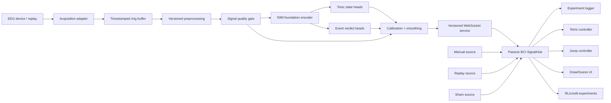
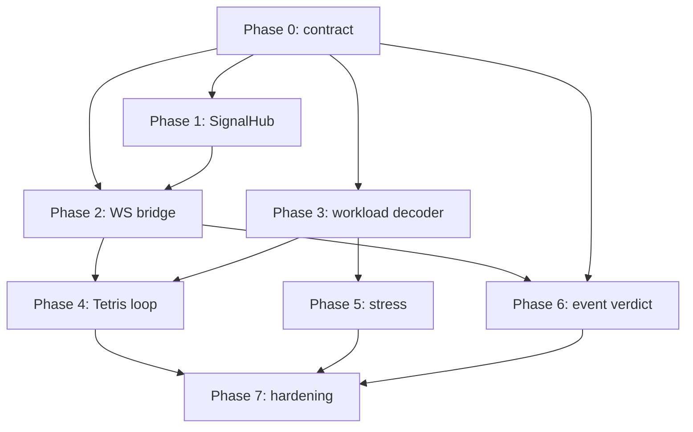

# NCC-OI-BCI × Passive BCI 集成计划

> 状态：Draft for agent review  
> 日期：2026-08-10  
> 上游仓库：[ttkx-web/NCC-OI-BCI](https://github.com/ttkx-web/NCC-OI-BCI)  
> 目标仓库：Passive BCI  
> 本文用途：作为实现前的设计、实验与风险审查基线；不代表已经验证模型效果。

## 1. 执行结论

可以整合，但应把 NCC-OI-BCI 当作“EEG 表征与在线推理底座”，不能直接把其现有四分类运动想象输出解释成压力、满意度或认知负荷。

推荐采用以下边界：

- NCC/Python 侧负责采集、预处理、基础模型编码、任务头推理、质量控制和模型版本管理。
- Passive BCI/React 侧只消费规范化的实时信号，并负责实验逻辑、可视化、日志和闭环控制。
- 两侧通过版本化 WebSocket 协议通信，不把 PyTorch 推理嵌入浏览器。
- 第一阶段只打通“认知负荷 → Tetris regulate 模式”的最小闭环。
- 压力作为第二个 tonic state 接入；满意度、偏好和 ErrP 采用独立的事件锁定解码链路。
- 认知负荷不应直接作为多智能体信用或逐动作 reward，只适合作为条件变量、可靠性信号、查询代价或控制上下文。

建议首个 MVP：

1. 三分类认知负荷任务头（low / medium / high）。
2. 输出转换为校准后的 0–100 连续值及置信度。
3. 支持 `manual`、`replay`、`live`、`sham` 四种数据源模式。
4. 只接入 Tetris 的 regulate 模式，设置平滑、限幅、失联回退和人工急停。

## 2. 目标与非目标

### 2.1 目标

- 复用 NCC-OI-BCI 的 EEG 在线采集、窗口化、基础模型和包管理能力。
- 为 Passive BCI 建立真正可替换、可回放、可观测的信号源层。
- 训练并验证认知负荷、压力等任务专用 decoder。
- 将生理信号安全地接入闭环实验，同时保留手动输入作为对照和降级路径。
- 让每个线上输出都可以追溯到输入窗口、模型版本、质量状态和实验事件。

### 2.2 非目标

- 不把现有运动想象四分类 head 直接复用为心理状态估计器。
- 不在第一阶段同时实现压力、满意度、负荷、专注、唤醒和 ErrP 全部任务。
- 不在获得被试外验证、校准和闭环安全证据前，将模型输出用于强控制。
- 不在第一阶段重写 NCC 的现有 MI 演示路径。
- 不默认基础模型优于 PSD、EEGNet 等紧凑基线；必须通过实验验证增量价值。

## 3. 核心概念拆分

### 3.1 Tonic state：连续状态信号

适合对象：

- cognitive workload
- stress
- focus/engagement
- arousal

典型特点：使用数秒级滑动窗口，按固定步长连续更新。它们适合调节环境难度、反馈强度或交互策略。

### 3.2 Event verdict：事件锁定信号

适合对象：

- satisfaction / preference
- error-related potential（ErrP）
- surprise
- 对单次动作、答案或 agent 输出的评价

典型特点：必须围绕外部事件切 epoch，并保留刺激/动作发生时间。它们不能由连续负荷流简单替代。

### 3.3 使用约束

- 负荷高不等于系统行为错误。
- 压力高不等于用户不满意。
- 唤醒和效价不能当作同一维度。
- 模型低置信度、伪迹或失联时应进入 `rejected`、`stale` 或 `disconnected` 状态，不能静默沿用旧值。

## 4. 推荐系统架构



架构原则：

- Python 服务是 EEG 时间、窗口和模型推理的权威来源。
- 浏览器记录服务端源时间和本地接收时间，不能只依赖 `performance.now()`。
- SignalHub 对各实验提供统一订阅接口，实验组件不再自行构造 `ManualSignalSource`。
- 所有输出都携带质量、置信度和 provenance；下游控制器负责定义如何降级。
- MI runtime 保持可运行，新 passive runtime 通过新包类型和策略并行演进。

## 5. 跨仓库接口契约

### 5.1 WebSocket 消息

推荐后端按窗口发送一个多信号 frame，由前端 SignalHub 解复用：

```json
{
  "schemaVersion": 1,
  "type": "signal.frame",
  "sessionId": "session-uuid",
  "sequenceId": 1842,
  "sourceTimeMs": 1786353100123,
  "window": {
    "startMs": 1786353096123,
    "endMs": 1786353100123
  },
  "signals": {
    "cognitive_load": {
      "value": 67.2,
      "confidence": 0.81,
      "status": "ok"
    },
    "stress": {
      "value": 54.9,
      "confidence": 0.63,
      "status": "ok"
    }
  },
  "quality": {
    "artifactProbability": 0.08,
    "validChannelCount": 58,
    "latencyMs": 93
  },
  "model": {
    "packageId": "passive-state-50m",
    "version": "0.1.0",
    "preprocessingVersion": "prep-v1"
  }
}
```

状态枚举：

```text
ok | rejected | warming_up | stale | disconnected | error
```

协议要求：

- `sequenceId` 单调递增，用于丢包和乱序检测。
- 时间统一使用 Unix epoch 毫秒；前端另记 `receivedTimeMs`。
- `value` 的范围和语义由模型包 manifest 声明，浏览器不得自行猜测。
- 不允许只发送一个无置信度的裸分数。
- 服务启动、模型切换、校准变更应发送独立的 control/event 消息。
- schema 使用显式版本；不兼容变更提升主版本。

### 5.2 Passive BCI 类型草案

```ts
type SignalChannel =
  | 'cognitive_load'
  | 'stress'
  | 'satisfaction'
  | 'focus'
  | 'arousal'
  | 'errp'
  | 'rating'
  | 'generic'

type SignalStatus =
  | 'ok'
  | 'rejected'
  | 'warming_up'
  | 'stale'
  | 'disconnected'
  | 'error'

interface SignalSample {
  channel: SignalChannel
  value: number | null
  confidence: number | null
  status: SignalStatus
  sequenceId: number
  sourceTimeMs: number
  receivedTimeMs: number
  windowStartMs: number
  windowEndMs: number
  source: 'manual' | 'replay' | 'live' | 'sham'
  meta: Record<string, unknown>
}
```

### 5.3 事件锁定请求草案

满意度或 ErrP 解码需要浏览器把实验事件传回后端：

```json
{
  "schemaVersion": 1,
  "type": "experiment.marker",
  "sessionId": "session-uuid",
  "eventId": "event-uuid",
  "sourceTimeMs": 1786353100123,
  "eventKind": "agent_action_shown",
  "payload": {
    "trialId": "trial-42",
    "agentId": "agent-b"
  }
}
```

事件时钟同步误差必须在实验报告中量化。若浏览器与采集服务不在同一机器，应实现 clock-offset 估计或由采集端接收硬件 marker。

## 6. NCC-OI-BCI 后端改造计划

### 6.1 保留与复用

- 设备/回放输入适配器。
- 实时缓冲、窗口拼接和基础运行时生命周期。
- 50M 模型加载及 `encode_tensor` 一类表征接口。
- schema-v2 模型包、资源探测和诊断页面的思路。
- 模型层选择、checkpoint 加载和设备选择能力。

### 6.2 必须重构

- 将当前对 `59 × 4000 → 64 × 400`、4 秒窗口和 MI 四分类的硬编码约束抽象为 package policy。
- 将“窗口合法性”“预处理”“backbone”“task head”“校准”拆成可独立测试的阶段。
- 支持 passive-state 包类型，不污染现有 MI 包。
- 增加持续服务 API，而不是只依赖演示界面或单次 probe。
- 将零相位 `filtfilt` 离线流程与实时因果滤波区分，记录算法延迟与边界效应。
- 明确坏道、缺道、参考电极和通道重映射策略。

### 6.3 任务头路线

第一版建议采用冻结 backbone + 小型任务头：

```text
EEG window
  -> foundation encoder
  -> selected-layer token representation
  -> temporal/token pooling
  -> LayerNorm
  -> MLP or linear ordinal head
  -> calibration
  -> value + confidence + rejection status
```

认知负荷首版可用三分类 ordinal head：

```text
P(low), P(medium), P(high)
value = 100 * (0.0 * P(low) + 0.5 * P(medium) + 1.0 * P(high))
```

该映射只是 UI/控制接口，不代表真实心理量表的线性单位。概率必须先完成验证集校准。

后续模型选择：

- 分立 head：数据少、任务定义不同、风险更低。
- 共享多任务 head：有足够多任务同被试数据后再评估。
- 个体校准层：支持少量校准 trial，但同时保留零样本结果。
- 端到端微调：只有冻结表征明显不足且数据量允许时才进入。

### 6.4 模型包建议字段

```yaml
schema_version: 3
package_type: passive_state
package_id: passive-state-50m-workload
version: 0.1.0

input:
  modality: eeg
  sample_rate_hz: 100
  window_sec: 4.0
  step_sec: 0.5
  channel_order: []
  reference: to_be_confirmed

preprocessing:
  version: prep-v1
  bandpass_hz: [0.1, 45.0]
  resample_hz: 100
  normalization: training_contract

encoder:
  checkpoint_sha256: required
  layer_index: 8
  pooling: mean_tokens

head:
  task: cognitive_load
  output: ordinal_3
  classes: [low, medium, high]

calibration:
  method: temperature_scaling
  artifact_reject_threshold: provisional
```

所有尚未确认的字段应阻止 production 包加载，不能依赖隐含默认值。

## 7. Passive BCI 前端改造计划

### 7.1 信号基础设施

建议新增或重构以下职责：

- `SignalHub`：集中管理连接、通道、最近样本和订阅。
- `WebSocketSignalSource`：协议校验、重连、心跳、乱序与 stale 处理。
- `ReplaySignalSource`：按原始时间或加速时间回放已记录 frame。
- `ShamSignalSource`：盲法对照，可延迟、打乱或播放配对数据。
- `SignalProvider` / `useSignal(channel)`：通过 React context 注入信号源。
- `SourceSelector`：在实验启动前选择 manual/replay/live/sham，运行中锁定并记日志。

现有 `ManualSignalSource` 应继续保留，并实现与 live source 相同的接口和状态语义。

### 7.2 日志升级

每条消费记录至少包含：

- 实验 session/trial/event ID。
- 信号的 `sourceTimeMs`、浏览器 `receivedTimeMs`、窗口起止时间。
- 信号值、置信度、状态、模型包和预处理版本。
- 控制器使用前值和使用后值，例如 EMA、限幅、deadband 后的值。
- 产生的具体控制动作。
- 连接、重连、模型切换、人工覆盖和急停事件。

### 7.3 各实验接入顺序

| 实验 | 首选信号 | 用法 | 风险与限制 |
|---|---|---|---|
| Tetris regulate | cognitive_load，后续 stress | 调低高负荷时的难度或节奏 | 必须限幅、平滑并避免振荡 |
| Tetris challenge | 暂不 live 接入 | 只做离线/受控研究 | 高压力→更快可能形成正反馈 |
| Jump | cognitive_load/stress | 调节障碍或反馈强度 | 需先定义清晰控制变量 |
| Draw/Guess | satisfaction/event verdict | 对展示结果的事件锁定反馈 | 不能用 tonic stress 替代满意度 |
| RL Graph | ErrP/preference | 作为稀疏评价或查询信号 | tonic workload 只能作为条件/可靠性，不作逐 agent reward |
| Card/CIT 类任务 | event-locked ERP | trial 级判别 | 需要高精度 marker 与独立 epoch pipeline |

## 8. 工作阶段与交付物

### Phase 0：契约冻结与证据核验

任务：

- 核对 50M checkpoint 的训练通道、参考、滤波、重采样、裁剪和标准化契约。
- 解决通道描述中 `Iz/F9/F10` 与 `Iz/A1/A2` 等潜在冲突。
- 明确首个认知负荷数据集、标签定义、被试划分和使用许可。
- 决定部署硬件、采集设备、采样率、期望更新频率和延迟预算。
- 冻结 WebSocket schema v1 和模型包 manifest 草案。

交付物：

- `preprocessing-contract.md`
- `signal-protocol-v1.schema.json`
- `passive-model-package.schema.json`
- 数据集/标签审计表
- 风险登记表

退出条件：输入和标签语义不存在未记录的猜测。

### Phase 1：Passive BCI 信号层解耦

任务：

- 扩展 `SignalSample` 类型和状态模型。
- 实现 SignalHub、Provider、manual/replay/sham source。
- 把实验内部创建的 manual source 移到统一依赖注入层。
- 扩展 logger，记录双时间戳和 provenance。
- 先用合成数据保持现有 UI 行为不变。

交付物：

- 可切换的信号源框架
- manual 行为回归测试
- replay 可复现实验
- schema validation 测试

退出条件：无后端时，所有现有实验仍可用 manual 模式运行。

### Phase 2：WebSocket 桥接与端到端仿真

任务：

- 在 Python 侧实现 mock/replay WebSocket 服务。
- 前端实现 live source、重连、心跳、stale 和乱序处理。
- 注入延迟、丢包、断线、伪迹和低置信度场景。
- 实现 health、model info 和 session handshake。

交付物：

- 合成数据端到端演示
- transport 集成测试
- 延迟和时钟偏移报告

退出条件：断线、乱序或低质量输入不会产生未经标记的控制动作。

### Phase 3：认知负荷 decoder 离线验证

任务：

- 建立统一 preprocessing pipeline，并锁定版本和哈希。
- 训练冻结 50M encoder + ordinal head。
- 同时训练经典 PSD + logistic/LDA、EEGNet、随机初始化同构模型等基线。
- 进行严格被试外评估、校准、拒识和漂移测试。
- 导出 passive-state 模型包。

交付物：

- 数据卡与模型卡
- 可复现实验配置和 seed
- 被试外指标与统计区间
- 校准曲线、risk–coverage 曲线
- 可加载的 workload 模型包

退出条件：达到第 11 节的科学验收门槛，否则停止闭环接入并记录负结果。

### Phase 4：Tetris regulate 最小闭环

任务：

- 对 workload 做 EMA、deadband、rate limit 和置信度门控。
- 仅调节一个可解释参数，例如 gravity interval。
- 加入 neutral fallback、人工覆盖、上下限和急停。
- 先 replay，再内部 live pilot，最后才进入被试实验。

交付物：

- workload → control 映射配置
- replay 闭环测试
- live pilot 日志
- 稳定性与延迟报告

退出条件：闭环不振荡、不出现正反馈失控，失联时可在规定时间内回到 neutral。

### Phase 5：压力与多信号状态

任务：

- 定义压力标签来源，区分主观 stress、arousal 和生理激活。
- 训练独立 stress head，并评估与 workload 的混淆。
- 评估共享 encoder + 多 head 是否优于独立模型。
- 设计 signal fusion，但保留各信号的单独质量状态。

退出条件：压力输出在被试外和校准指标上独立成立，且不会被简单任务难度完全解释。

### Phase 6：满意度、偏好与 ErrP

任务：

- 建立浏览器 marker → EEG epoch 的可验证时间链路。
- 为 Draw/Guess 或 RL 设计明确的刺激、事件和反馈协议。
- 分别训练 satisfaction/preference/ErrP decoder。
- 将输出用作稀疏评价、查询信号或辅助 reward，而非无条件替代显式反馈。

退出条件：事件对齐误差、单 trial 性能、校准和伪迹拒识满足预注册门槛。

### Phase 7：工程加固与发布

任务：

- 增加 CI、容器/环境锁定、模型哈希和 SBOM。
- 补充许可、隐私、数据留存和可撤回机制。
- 加入监控、版本回滚、模型热切换保护和审计日志。
- 完成跨平台和目标硬件 soak test。

## 9. 依赖关系



关键路径是 `P0 → P3 → P4`。Phase 1 和 Phase 2 可以在模型训练期间使用 mock/replay 数据推进，但不能跳过 Phase 0 的接口与预处理契约。

## 10. 测试与评估计划

### 10.1 前端单元测试

- schema 合法/非法消息。
- sequence 丢失、重复和乱序。
- stale、断线、重连和 session 切换。
- manual/replay/live/sham 的接口一致性。
- `rejected` 与 `null` 值不触发控制。
- 控制器 EMA、deadband、rate limit、上下限和 neutral fallback。
- logger 的源时间、接收时间和模型版本完整性。

### 10.2 后端单元测试

- 通道重排、缺道、坏道和参考策略。
- 窗口长度、步长和时间戳连续性。
- 离线与流式预处理的一致性边界。
- 模型包 schema、哈希、版本和不兼容拒绝。
- backbone layer/pooling/head 输出形状。
- 概率归一化、校准和低质量拒识。
- CPU/GPU 数值差异在声明容差内。

### 10.3 集成与故障注入

- mock server → browser → logger 的完整链路。
- 延迟、抖动、丢包、暂停和批量补发。
- WebSocket 服务重启与模型切换。
- 采集设备断开、部分通道冻结和高伪迹。
- 浏览器刷新后 session 与 trial 不串线。
- marker round-trip 和 clock-offset 测试。

### 10.4 离线科学评估

数据划分必须以被试为单位，禁止窗口随机划分造成泄漏。

至少报告：

- balanced accuracy、macro F1、AUROC/AUPRC（适用时）。
- MAE/Spearman（连续或序数输出适用时）。
- NLL、Brier score、ECE 和可靠性图。
- risk–coverage：拒绝低置信度样本后的性能。
- 每被试结果、置信区间和失败被试比例。
- 跨 session、跨设备、跨任务和随时间漂移。
- 零样本、少量个体校准和完整个体校准的差异。
- p50/p95/p99 推理及端到端延迟。

### 10.5 必须包含的基线

- manual signal。
- sham/random/延迟配对信号。
- PSD/bandpower + LDA 或 logistic regression。
- EEGNet 或同级紧凑监督模型。
- 50M frozen encoder + linear/MLP head。
- 同构随机初始化 encoder 控制。
- 数据量足够时再加入 50M 微调版本。

### 10.6 闭环实验条件

建议至少比较：

1. 固定控制。
2. manual/self-report 控制。
3. sham decoder 控制。
4. live decoder 控制。

报告任务表现、主观负荷/压力、控制平滑性、失控/急停次数、适应速度、用户体验和模型置信度覆盖率。

## 11. 验收门槛

具体数值应在看到数据分布后预注册；以下是 gate 结构，而不是事后挑选指标。

### Gate A：契约可信

- checkpoint、通道、参考和预处理定义完整且可追溯。
- 同一原始片段经过训练 pipeline 与部署 pipeline 后，在预定容差内一致。
- 模型包包含不可变版本和哈希。

### Gate B：传输安全

- 消息丢失、乱序、断线和过期都能被检测。
- 低质量或失联状态不继续驱动闭环。
- 每次控制动作可追溯到具体信号 frame。

### Gate C：decoder 有增量价值

- 被试外性能显著优于多数类与简单行为基线。
- 与 PSD、EEGNet、随机初始化同构模型进行公平比较。
- 校准和拒识性能满足预注册标准。
- 结果不是由被试、session 或窗口泄漏造成。

### Gate D：实时性满足闭环

- 更新率、端到端延迟和抖动满足具体实验要求。
- 伪迹拒识不会造成不可接受的控制空窗。
- 目标硬件连续运行稳定。

### Gate E：闭环有效且安全

- 相比 sham/fixed 条件有预注册的行为或体验收益。
- 没有明显振荡、正反馈或长时间饱和。
- 模型不确定时回退策略可预测且可审计。

任何一项未通过，都应保留 manual/replay 模式并停止扩大 live 控制范围。

## 12. 初始运行配置草案

以下仅用于工程起步，必须通过数据与 pilot 调整：

```yaml
runtime:
  mode: replay                 # manual | replay | live | sham
  window_sec: 4.0
  step_sec: 0.5
  sample_rate_hz: 100

transport:
  ws_url: ws://127.0.0.1:8765/signals
  heartbeat_sec: 1.0
  stale_after_ms: 2000
  reconnect_backoff_ms: [250, 500, 1000, 2000, 5000]

decoder:
  task: cognitive_load
  output: ordinal_3
  confidence_min: provisional
  artifact_reject_threshold: provisional

control:
  experiment: tetris_regulate
  neutral_value: 50
  ema_tau_sec: 3.0
  deadband: 5
  max_change_per_sec: 5
  fallback: neutral
```

配置优先级：命令行/实验 session 配置 > 环境变量 > 配置文件 > 安全默认值。每次实验必须把最终解析后的完整配置写入日志。

## 13. 主要风险与缓解措施

| 风险 | 影响 | 缓解 |
|---|---|---|
| 训练与部署预处理不一致 | 模型输出无效 | Phase 0 建立 golden-sample 一致性测试 |
| 通道/参考定义冲突 | 表征漂移 | 模型包显式声明，缺失时拒绝加载 |
| 标签构念含糊 | stress/workload/satisfaction 混淆 | 每个任务独立 protocol、量表和模型卡 |
| 窗口级随机划分 | 严重数据泄漏 | 强制 subject/session-disjoint split |
| 过度相信 foundation model | 错误选型 | 与经典、紧凑、随机初始化基线公平比较 |
| 零相位滤波用于实时 | 延迟与边界不真实 | 分离 offline 与 causal streaming pipeline |
| 高频控制抖动 | 用户体验差或系统不稳 | EMA、deadband、rate limit、置信度门控 |
| challenge 模式正反馈 | 压力越高任务越难 | MVP 只使用 regulate，challenge 需单独安全审查 |
| 失联仍沿用旧值 | 不可控行为 | stale TTL、neutral fallback、急停 |
| 跨机器时钟偏移 | event decoder 标签错位 | clock sync 测试或硬件 marker |
| 个体差异 | 被试外泛化差 | 报告每被试结果并比较少样本校准 |
| 隐私与伦理 | 生理状态误用 | 最小化存储、明确同意、撤回和用途限制 |

## 14. 首轮文件级任务建议

Passive BCI 侧：

- 扩展 `src/lib/signal/types.ts`。
- 保留并适配 `src/lib/signal/manual.ts`。
- 新增 `src/lib/signal/hub.ts`。
- 新增 `src/lib/signal/websocket.ts`。
- 新增 `src/lib/signal/replay.ts` 和 `sham.ts`。
- 新增 React provider/hook，具体目录遵循现有项目结构。
- 扩展 `src/lib/logger.ts`。
- 首先改造 Tetris；其余实验只在 SignalHub 稳定后迁移。

NCC-OI-BCI 侧：

- 保持现有 MI backend 与包可运行。
- 抽取通用窗口策略和 preprocessing contract。
- 新增 passive-state package schema。
- 新增 tonic-state runtime 与任务头加载器。
- 新增 WebSocket signal service、health/model-info endpoint。
- 新增 replay driver、golden samples 和端到端测试数据。

建议先以两个独立 PR 序列推进：

1. Passive BCI：SignalHub + mock/replay + 日志，不依赖 NCC。
2. NCC-OI-BCI：passive runtime + workload package + WebSocket。
3. 集成 PR：协议联调和 Tetris regulate。

## 15. 待确认问题

以下问题会实质改变方案，进入实现前必须回答：

1. 50M checkpoint 的确切来源、license、哈希和训练 preprocessing 是什么？
2. 当前实时设备固定为 Neuracle JellyFish，还是还需要 LSL、BrainFlow 或文件 replay？
3. 目标 EEG montage、参考方式和可接受缺道数量是什么？
4. 首个认知负荷数据集和标签定义是什么？是否有 Passive BCI 自采数据？
5. 首版目标是跨被试零样本、少样本个体校准，还是完全个体化？
6. workload 输出需要序数等级、连续分数，还是两者都要？
7. Tetris 的主要目标是维持目标负荷、降低压力，还是最大化任务表现？
8. 允许的更新周期、p95 延迟和连续失联时间分别是多少？
9. 满意度的操作性定义是显式 rating、偏好选择、ErrP，还是情感效价？
10. 生理原始数据、embedding 和推理输出的保存/删除策略是什么？

## 16. 给审查 agent 的审查清单

请不要只判断“能否运行”，重点检查以下问题：

- 架构边界是否合理，是否有必要把推理服务与前端进一步隔离？
- WebSocket schema 是否足以支持重放、审计、乱序和事件锁定？
- 预处理契约中是否遗漏 reference、坏道、归一化或在线滤波细节？
- workload、stress、satisfaction 的构念是否被正确区分？
- baseline、数据划分、校准和拒识是否足以防止虚假提升？
- 闭环控制是否存在正反馈、振荡、迟滞或失联风险？
- MVP 是否仍然过大，哪些任务应后移？
- 哪些 gate 应被设为硬阻断条件？
- 是否存在 license、隐私、伦理或设备 SDK 部署障碍？
- 文件级任务是否会与现有未提交改动冲突？

建议审查回复格式：

```text
Verdict: approve | revise | block

Blocking issues:
- ...

Architecture concerns:
- ...

Scientific validity concerns:
- ...

Missing tests or gates:
- ...

Recommended scope changes:
- ...
```

## 17. 推荐下一步

在任何模型训练或前端大改之前，先完成 Phase 0，并让审查 agent 对以下三份契约给出明确结论：

1. checkpoint 与 preprocessing contract；
2. WebSocket signal schema；
3. workload 标签、划分、baseline 与验收标准。

如果三项通过，再并行推进前端 SignalHub/mock bridge 和离线 workload decoder。这样即使 foundation model 最终没有优于紧凑基线，Passive BCI 仍会得到可复用的实时信号源架构，而不会把研究有效性绑定在单一模型上。
